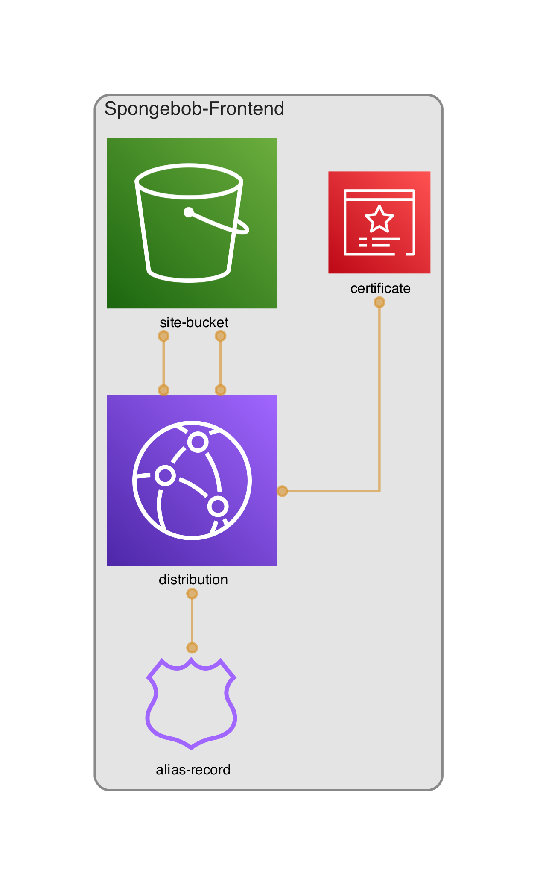
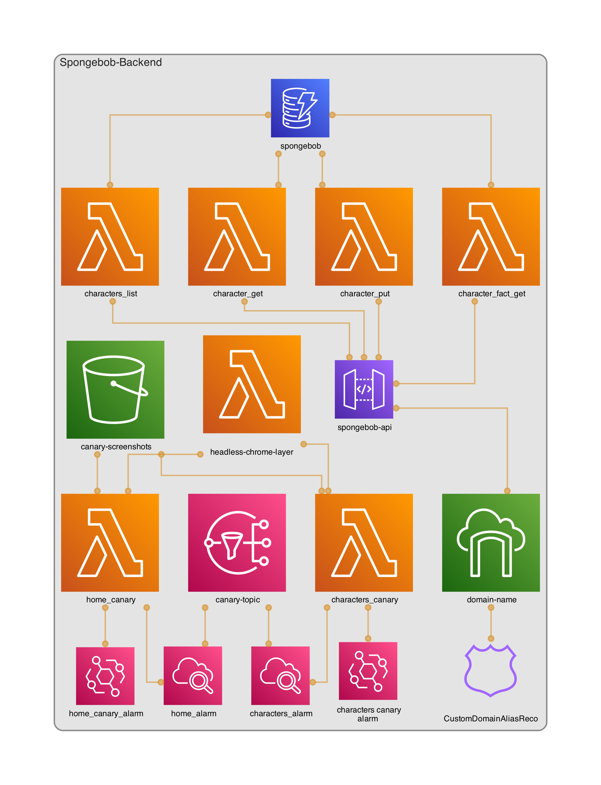

# [MyLeg.org](https://myleg.org)

This is a demo project built for a [Talk at MomentumDevCon](https://momentumdevcon.com/session/348720). It demonstrates serverless canary testing. The website is a standard serverless 3-tier web app. 
The content is centered around the guy who lives in a pineapple under the sea.

## Project Structure
```
├── backend
|   ├── cdk - All IAC used to deploy every component of the backend
|   ├── functions - The source code for all the lambdas
|   └── tests - Every level of the testing pyramid from unit -> canary
|       ├── unit 
|       ├── integration
|       ├── e2e
|       └── canaries
|           ├── api - Canary tests that invoke the API portion 
|           ├── e2e - Canary tests that directly hit the frontend
|           └── layer-headless-chrome.zip - source for the lambda layer used to run selenium, including for completeness
└── frontend
    ├── cdk - All IAC used to deploy every component of the frontend
    ├── public - Assets for the frontend website
    └── src - Source code for the frontend
```

## Architecture/Tech Stack
- AWS - All infrastructure is hosted using serverless services on AWS 
- AWS CDK - All infrastructure is manged as Infrastructure as Code (IAC) with the CDK.
- Python - Backend programming language used for lambas and IAC
- React - Frontend programming language
- Content - Most of the data is sourced from [Fandom](https://spongebob.fandom.com)

### Frontend Architecture Diagram


### Backend Architecture Diagram


## Canaries
The main purpose of this project is to show the efficacy of serverless canaries. The purpose of canary testing is to notify
teams that their application is not functioning correctly. 

In this project the canaries are hosted on AWS Lambda where they run [selenium](https://selenium-python.readthedocs.io/). These canaries open a browser and
perform actions on the live, production application. If any of them fail, the team will be paged via pagerduty. 

In order to run selenium in lambda you must add a few packages and binaries. For this project I package the dependencies in the form of a lambda layer.
There are many ways to do this, but for this project I followed [This Github Repo](https://github.com/diegoparrilla/headless-chrome-aws-lambda-layer)
as it is IMO the simplest solution.

Specifically, I publish the layer using [this cdk](backend/cdk/app.py). Then, I reference that layer in my lambda functions.

## Other Uses
Although the main purpose of this project was to show people how to run canaries in lambda, this project
also serves as a good example of creating a 3-tier **serverless** web application using Python, CDK, and React. 


## Acknowledgements
* [DiegoParilla's lamba layer project](https://github.com/diegoparrilla/headless-chrome-aws-lambda-layer)
* [Fandom's SpongeBob page](https://spongebob.fandom.com/wiki/Encyclopedia_SpongeBobia)
* [CDK Diagram Generator](https://github.com/pistazie/cdk-dia)
